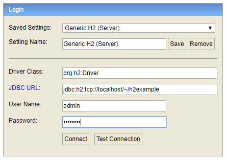
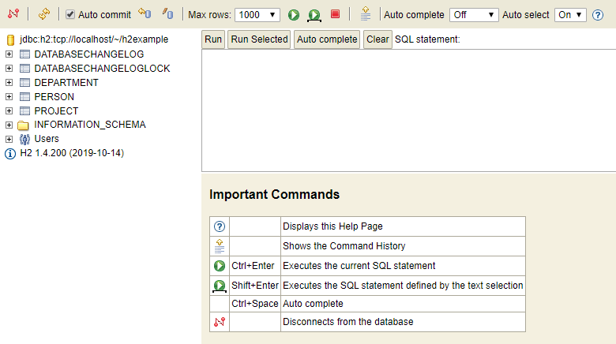

# Example of Using LiquibasePro via Jenkins

### H2 Database Setup
This example uses a TCP Server connection for the H2 Database.  The database needs to be created first.

To create the database using H2 shell:
1. Copy the h2_project\h2example.mv.db to your home directory.
2. From the liquibase_pro\lib folder run:
		java -cp h2*.jar org.h2.tools.Shell
3. Enter the following values:
* URL: jdbc:h2:tcp://localhost/~/h2example
* Driver: org.h2.Driver
* User: admin
* Password: password
4. If you change any of these values you will need to make corresponding changes to the h2_project\liquibase.properties file.

Once the database is created you should be able to view it using the H2 Console:
1. Run the h2-1.4.200.jar file in liquibase_pro\lib\
2. This action should bring up the H2 Console Login Screen
* Setting Name: Generic H2 (Server)
* Driver Class: org.h2.Driver
* JDBC URL: jdbc:h2:tcp://localhost/~/h2example
* User Name: admin
* Password: password
3. Click Connect to view the database.

  

### Jenkins Setup
1. Create a Jenkins pipeline and reference the jenkinsfile-examples/updateDb.groovy in the Script Path.
2. You may need to update the jenkinsfile-examples/updateDb.groovy script to use the appropriate node label for your Jenkins installation.  
3. Depending on your environment you may need to update the bat statements to use sh.

### Results
1. Run the Jenkins script using "Build Now"
2. After a successful completion, return to the H2 Console and Refresh
3. You should see 5 new tables created:
* DATABASECHANGELOG and DATABASECHANGELOGLOCK: LiquibasePro created these tracking tables
* DEPARTMENT and PROJECT: These tables are created from changesets in h2_project\h2ChangeLog.xml
* PERSON: This table is created from a SQL script in h2_project\sql\create_person_table.sql

  

